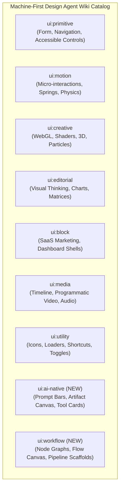
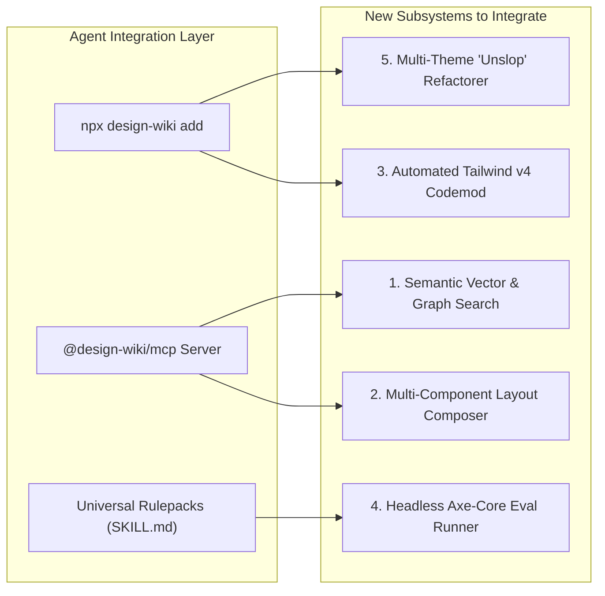

Component Libraries & Machine-First Design Agent Wiki Enhancement Blueprint

---

## Executive Summary

The **Machine-First Design Agent Wiki** serves as the deterministic ground-truth foundation for autonomous AI coding agents (Claude Code, Cursor, Windsurf, Codex, Antigravity, etc.). By providing pre-tested, accessible, zero-slop component primitives, the wiki eliminates the "Grind" of repetitive CSS generation, prevents hallucinations, and enforces strict design taste dials (**Design Variance**, **Motion Intensity**, and **Visual Density**).

This deep research report reviews the **61 resources** in [`Component libraries.txt`](file:///d:/Concept%20projectcs/Agent%20Wiki/Component%20libraries.txt) (web registries, GitHub repositories, and anti-slop tooling), compares them against the wiki's current state (~112 compiled components), and identifies **new components, architectural subsystems, AI-native interfaces, and quality guardrails** to integrate into the wiki.

```
┌─────────────────────────────────────────────────────────────────────────────────────────┐
│                        MACHINE-FIRST DESIGN AGENT WIKI                                  │
├──────────────────────────┬─────────────────────────────┬────────────────────────────────┤
│   CURRENT STRENGTHS      │      EXPANSION TARGETS      │     TOOLING & GUARDRAILS       │
│  • 112+ Compiled Items   │  • AI-Native Interface Kit  │  • Semantic Vector Search MCP  │
│  • 7-Category Taxonomy   │  • Data Visualization/Flows │  • Layout Composer Tool        │
│  • 30 Anti-Slop Rules    │  • 3D Spatial & Canvas Kit  │  • Axe-Core / A11y Test Runner │
│  • <15KB Payload Enforcer│  • Enterprise Form Controls │  • 35-Rule Anti-Slop Matrix    │
│  • Stdio/HTTP MCP Server │  • Spring Gesture Primitives│  • Multi-Theme Unslop Engine   │
└──────────────────────────┴─────────────────────────────┴────────────────────────────────┘
```

---

## 1. Audit & Analysis of `Component libraries.txt`

The resources in [`Component libraries.txt`](file:///d:/Concept%20projectcs/Agent%20Wiki/Component%20libraries.txt) span three core pillars:

### A. Web Registries & Portals (31 Resources)
1. **21st.dev**: Centralized open registry aggregating design-engineer components; pioneer of MCP-driven natural language component discovery and installation.
2. **React Bits (`reactbits.dev`)**: Creative text animations, interactive physics cursors, and generative WebGL/canvas background shaders.
3. **HeroUI (`heroui.com`, formerly NextUI)**: Production-grade, highly accessible React 19/Tailwind components with rich select, autocomplete, date pickers, and modal drawers.
4. **DaisyUI (`daisyui.com`)**: Semantic CSS-first utility classes, device mockups (browser, phone, window, code terminal), countdown timers, radial gauges, and chat bubbles.
5. **ReUI (`reui.io`)**: Enterprise data grids (sorting, column filtering, virtualization), 638+ hand-crafted animated SVG icons, file upload dropzones, and multi-step filter builders.
6. **Motion Primitives (`motion-primitives.com`)**: Emil Kowalski / ibelick micro-interactions: morphing dialogs, text morphs, progressive blurs, and spring layout cards.
7. **Tailark (`tailark.com` / `tailark/blocks`)**: Tailwind v4 marketing blocks, asymmetrical bento grids, pricing matrices, and customer story masonry.
8. **Kokonut UI (`kokonutui.com`)**: Micro-interactions, dynamic AI input bars, 3D credit card inputs, spring dialogs, tilt cards, and matrix loaders.
9. **SmoothUI (`smoothui.dev`)**: Spring physics, swipeable list gestures, drag-to-reveal drawers, and dynamic bottom sheets.
10. **Cult UI (`cult-ui.com`)**: 78+ animated components (Dynamic Island, Hero Liquid Metal, Heatmaps, Neumorphic buttons) and 100+ AI SDK Agent interaction patterns.
11. **Aceternity UI (`ui.aceternity.com`)**: Landing page components (Hero Parallax, 3D Pin, Sparkles, Background Beams Collision, Google Gemini effect, Placeholders & Vanishing Input, Apple Cards Carousel, World Map).
12. **Tripwire (`tripwire.sh`)**: Security hardening, prompt injection detection, and AST malicious payload scanning.
13. **Icons0 (`icons0.dev`)**: Hybrid search (FTS5 + Gemini embeddings) across 200k+ vector icons, zero-runtime SVG injection, and MCP icon lookup tools.
14. **Evil Buttons (`evilbuttons.com`)**: Playful physics-based buttons, sound synthesis on click, squishy velocity, and bouncy hover feedback.
15. **Fancy Components (`fancycomponents.dev`)**: Creative frontend physics, text scramblers, gravity galleries, liquid buttons, and magnetic docks.
16. **Canvas UI (`canvasui.dev`)**: HTML-in-Canvas experimental rendering, WebGL shaders (Blaze, Liquid, Shatter), 3D glTF models, and CSS fallbacks.
17. **Remocn (`remocn.dev`)**: Remotion + shadcn programmatic video engine, timeline players, karaoke caption streams, split video comparators, and kinetic typography.
18. **NeonBlade UI (`neonbladeui.neuronrush.com`)**: Cyberpunk neon HUD frames, holographic borders, matrix streams, and terminal scanline effects.
19. **Dot Matrix (`dotmatrix.zzzzshawn.cloud`)**: 55+ dot matrix canvas loaders, LED scoreboard matrices, audio visualizers, and flip clocks.
20. **Shark UI (`shark.vini.one`)**: Headless Ark UI / Zag.js state machines (Combobox, Rating, Color Picker, Tree View, Pin Input, Segmented Control).
21. **ThreeUI (`threeui.com`)**: Three.js / WebGL 3D viewports, orbit controls, spatial cards, and floating 3D geometry.
22. **Watermelon UI (`watermelon.ui`)**: Clean minimal primitives and micro-interaction switches.
23. **beUI (`beui.dev`)**: React 19 + Tailwind v4 + View Transitions API integration for seamless page switches and dark mode morphs.
24. **VengeanceUI (`vengenceui.com`)**: Visually aggressive dark-mode hero showcases with dedicated Cursor skill integration.
25. **Groot Studio (`grootstudio.dev`)**: 3D card tilts, creative motion tabs, and micro-animations.
26. **Kairo UI (`kairoui.online`)**: Zero-account Next.js SaaS landing page templates (Nova SaaS, Nexora AI).
27. **Shadcnblocks (`shadcnblocks.com`)**: Extensive library of marketing and dashboard sections.
28. **UI Layouts (`ui-layouts.com`)**: Complex app shells, multi-column bento grids, command palettes, and sidebar navigations.
29. **Shadcn Space (`shadcnspace.com`)**: Directory of color themes, design tokens, and creative extensions.

### B. Component & Design Repositories (27 Repositories)
- `cathrynlavery/diagram-design`: Editorial visual diagramming (architecture topology, cycle loops, fishbone root-cause diagrams, quadrant matrices, pyramids, decision trees, flowcharts, funnel conversion charts).
- `marcoripa96/i0`: Ultra-fast hybrid search icon engine with MCP tools.
- `HugoBlox/kit`: Structured Markdown content engine (publications, team profiles, portfolios, static clean exports).
- `Nutlope/hallmark`: Hassan El Mghari's design skill with 57 quality gates and 20+ design themes.
- `Leonxlnx/taste-skill`: Taste dial calibration matrix and LLM prompt system.

### C. Anti-Slop Repositories (3 Repositories)
- `aahil62/unslop`: Automated Claude Code plugin for site auditing, theme synthesis, and anti-slop refactoring.
- `petergyang/no-ai-slop`: Detection and stripping of 20+ AI writing clichés and robotic copy tropes.
- `dmmulroy/anti-slop`: Strict Oxlint rules enforcing TypeScript type hygiene, preventing fabricated certainty (`no-chained-type-assertions`).

---

## 2. High-Impact Components to Harvest & Integrate

Based on the audit of existing files versus the ecosystem catalog, here is the prioritized list of components to ingest across the wiki's taxonomy:



### Category 1: `ui:ai-native` (New Dedicated Category)
Modern AI agent applications require specialized UI primitives to render agentic reasoning, streaming outputs, and multimodal interactions:

| Component Slug | Target Library Origin | Description & Unique Capabilities |
| :--- | :--- | :--- |
| `ai-prompt-bar-expanded` | Kokonut UI / Cult UI | Multimodal prompt bar with voice recording button, attachment pill tray, model selector dropdown, token estimation counter, and slash-command trigger. |
| `ai-streaming-message` | Cult UI / Vercel AI SDK | Markdown streaming message container with flicker-free token rendering, copy button, feedback thumbs, and animated cursor stream. |
| `ai-reasoning-accordion` | Cult UI | Collapsible "Thinking Process" card showing step-by-step agent chain-of-thought, elapsed time counter, and tool execution status badges. |
| `ai-tool-call-card` | Cult UI / Agent Wiki | Visual inspector for MCP and agent tool executions, showing input parameters, live loading spinner, JSON inspector, and retry/error triggers. |
| `ai-artifact-sandbox-iframe`| 21st.dev / Agent Wiki | Split-screen live preview canvas with responsive device switcher, code/preview toggle, and version history diff slider. |
| `ai-human-in-the-loop-diff` | Origin UI / Cult UI | Interactive confirmation drawer displaying code diffs (`+` / `-`) with "Approve", "Modify Prompt", and "Reject" feedback controls. |
| `ai-prompt-template-library`| Cult UI / 21st.dev | Categorized card carousel of pre-tested agent prompts with one-click injection into active input. |

### Category 2: `ui:primitive` (Enterprise Forms & Complex Controls)
Expanding from basic inputs to advanced, accessible data-entry primitives (inspired by Origin UI, HeroUI, Shark UI):

| Component Slug | Target Library Origin | Description & Unique Capabilities |
| :--- | :--- | :--- |
| `otp-pin-input` | Origin UI / Shark UI | Accessible 6-digit PIN/OTP input with auto-focus advance, backspace regression, paste-handling, and masked character support. |
| `password-strength-meter` | Origin UI | Real-time zxcvbn-style entropy scoring bar with visual requirement checklist (length, symbol, number, case). |
| `multi-tag-input` | Shark UI / Origin UI | Keyboard-navigable badge input with tag creation, backspace deletion, autocomplete suggestions, and duplicate prevention. |
| `dual-range-slider` | Origin UI / HeroUI | Multi-thumb range slider with floating value tooltips, min/max bounds clamping, and step markers. |
| `file-upload-dropzone` | ReUI / Origin UI | Drag-and-drop zone with MIME validation, file size limits, thumbnail generation, upload progress bars, and abort buttons. |
| `tree-view-explorer` | Shark UI / ReUI | Accessible hierarchical file/folder tree view with expand/collapse animations, keyboard navigation, and custom node icons. |
| `color-picker-popover` | Shark UI / Origin UI | Color picker with HEX/RGBA/HSL mode switching, preset palette swatches, eyedropper tool, and alpha slider. |
| `rich-date-range-picker` | HeroUI / ReUI | Dual-month calendar popover with preset quick-picks (Today, Last 7 Days, Month to Date) and disabled range bounds. |
| `combobox-virtualized` | Shark UI / HeroUI | High-performance search combobox handling 10,000+ items via virtualization, with keyboard navigation and async loading states. |

### Category 3: `ui:editorial` (Data Visualization, Dashboards & Visual Thinking)
Expanding analytical visualization primitives (inspired by Tremor Raw, Recharts, and `diagram-design`):

| Component Slug | Target Library Origin | Description & Unique Capabilities |
| :--- | :--- | :--- |
| `interactive-area-chart` | Tremor Raw / Shadcn Chart | Responsive SVG/Canvas area chart with linear gradient fill, brush timeline zoom, and interactive cursor tooltip. |
| `donut-metric-card` | Tremor Raw | Donut chart featuring centered key metric, category percentage breakdown, and hover slice detachment. |
| `cohort-retention-heatmap` | Tremor Raw / ReUI | Matrix grid displaying user cohort retention percentages over time with conditional color intensity scaling. |
| `sankey-flow-diagram` | diagram-design | Node-to-node stream flow diagram illustrating distribution, funnel loss, and channel routing. |
| `gantt-roadmap-chart` | diagram-design / ReUI | Timeline schedule view with draggable milestone bars, dependency connection lines, and progress percentage markers. |
| `swot-analysis-matrix` | diagram-design | 2x2 grid layout for Strengths, Weaknesses, Opportunities, and Threats with distinct visual accents. |

### Category 4: `ui:motion` (Spring Physics, Gestures & Micro-Interactions)
Expanding fluid motion and physics (inspired by Motion Primitives, SmoothUI, Evil Buttons, and Magic UI):

| Component Slug | Target Library Origin | Description & Unique Capabilities |
| :--- | :--- | :--- |
| `text-morph-transition` | Motion Primitives / Magic UI | Smooth letter-by-letter layout morphing between arbitrary words/phrases using shared layout IDs. |
| `image-mouse-trail` | Motion Primitives / React Bits | Interactive pointer trail displaying trailing layered images with velocity-sensitive rotation and fade-out. |
| `orbiting-circles` | Magic UI | Nested rotating orbits carrying technology/brand icons with configurable speed and direction. |
| `animated-beam-pipeline` | Magic UI | SVG curved beam animation connecting distinct nodes with glowing laser pulses indicating data flow. |
| `swipeable-action-row` | SmoothUI | Mobile-first list item supporting horizontal swipe gestures to reveal delete, archive, and pin action triggers. |
| `squishy-physics-button` | Evil Buttons | Velocity-reactive button with squishy spring physics, elastic rebound, and optional Web Audio synthesis click sounds. |
| `scratch-to-reveal-card` | Magic UI | Canvas scratch-off surface revealing hidden discount codes or rewards beneath user gestures. |
| `dock-magnification` | Magic UI / Motion Primitives | macOS-style dock with mouse proximity magnification and smooth spring icon popups. |

### Category 5: `ui:creative` (WebGL Shaders, Generative Canvases & 3D)
Expanding high-craft visual effects (inspired by React Bits, Canvas UI, ThreeUI, and Cult UI):

| Component Slug | Target Library Origin | Description & Unique Capabilities |
| :--- | :--- | :--- |
| `ballpit-physics-canvas` | React Bits | Interactive 2D/3D bouncing ball physics simulation responding to gravity and mouse pointer repulsion. |
| `iridescence-shader-plane` | React Bits / Cult UI | WebGL fragment shader rendering chromatic oil-slick iridescence with configurable noise frequency. |
| `hyperspeed-tunnel` | React Bits | Three.js starfield/light-trail warp speed effect with adjustable speed, distortion, and neon color palettes. |
| `crt-terminal-scanlines` | Cult UI / NeonBlade UI | Retro CRT monitor emulator with animated horizontal scanlines, phosphor glow, screen curvature, and text flicker. |
| `audio-reactive-3d-sphere` | ThreeUI / Dot Matrix | Three.js vertex-displaced wireframe sphere reacting in real time to Web Audio API frequency data. |
| `grid-distort-interactive` | React Bits | Interactive grid mesh that warps and ripples under mouse cursor velocity with spring decay. |

### Category 6: `ui:block` (Marketing Sections, Hero Layouts & SaaS Shells)
Expanding page-level blocks (inspired by Tailark, Aceternity UI, Shadcnblocks, and Kairo UI):

| Component Slug | Target Library Origin | Description & Unique Capabilities |
| :--- | :--- | :--- |
| `hero-parallax-scroll` | Aceternity UI | Multi-row 3D perspective image grid that shifts and rotates as the user scrolls down the page. |
| `google-gemini-glow-hero` | Aceternity UI | Dark-mode hero section with layered animated SVG laser paths and responsive central CTA. |
| `interactive-roi-calculator` | Tailark / Shadcnblocks | Marketing block with interactive price sliders, team size selectors, and dynamic cost savings calculations. |
| `device-mockup-showcase` | DaisyUI / Magic UI | Pixel-perfect Safari browser and iPhone device frames with screenshot scroll-into-view animations. |
| `testimonial-masonry-marquee`| Tailark / Magic UI | Vertical and horizontal infinite-scroll masonry grid of user review cards with avatar verification. |
| `app-shell-sidebar-layout` | UI Layouts / ReUI | Production-ready SaaS dashboard shell with collapsible multi-tier sidebar, breadcrumbs, search bar, and user profile popover. |

---

## 3. Architectural Enhancements for the Agent Wiki

Beyond adding raw components, the following architectural upgrades will make the wiki more powerful for autonomous agents and developer tooling:



### 1. Semantic Vector & Graph Search in MCP (`semantic_search_components`)
- **Current Limitation**: MCP search relies on substring keyword filtering and dial ranges.
- **Enhancement**: Integrate an in-memory vector embedding index (using MiniSearch + local embeddings or Gemini embeddings via `@marcoripa96/i0` pattern).
- **Capability**: Allows agents to query fuzzy functional concepts (e.g., *"give me an interface component where users can confirm AI-suggested code changes"* $\rightarrow$ matches `ai-human-in-the-loop-diff`).

### 2. Multi-Component Layout Composer (`compose_layout_tree`)
- **Current Limitation**: Agents query one component at a time, often struggling with layout assembly and structural scaffolding.
- **Enhancement**: Add a new MCP tool `compose_layout_tree({ blueprint: "ai-saas-landing" | "analytics-dashboard" | "copilot-workspace" })`.
- **Capability**: Returns a fully composed layout tree with verified import statements, nested sub-components, responsive grid wrappers, and required dependency packages in a single tool call.

### 3. Automated Ingestion Codemod 2.0 (Tailwind v4 + React 19)
- **Current Limitation**: Upstream repositories frequently use legacy Tailwind v3 syntax (`bg-indigo-600`, `p-[17px]`, custom plugins) and React 18 `forwardRef`.
- **Enhancement**: Upgrade `packages/harvester/src/codemods/` with:
  - Automated `forwardRef` stripping (native in React 19).
  - Codemod remapping arbitrary pixel units (`p-[13px]` $\rightarrow$ `p-3`).
  - `@theme` variable injector transforming hardcoded hex colors into semantic CSS variables (`--color-primary`, `--color-card`).

### 4. Headless Evaluation Sandbox Harness (Sprint 11 Roadmap Goal)
- **Scope**: Deploy a Playwright + Axe-core + TypeScript compiler runner in `packages/eval-harness/`.
- **Capability**:
  - Automatically spins up an ephemeral Next.js 15 test project.
  - Installs harvested components.
  - Verifies zero TypeScript errors (`tsc --noEmit`).
  - Measures DOM render performance and enforces 100% WCAG 2.1 AA accessibility compliance across light and dark modes.

---

## 4. Expansion of the Anti-Slop Guardrail Matrix (35 Rules)

To further eliminate AI slop, the rule engine should expand from the current 30 rules to **35 comprehensive guardrails**:

```
┌─────────────────────────────────────────────────────────────────────────────────────────┐
│                      EXPANDED ANTI-SLOP GUARDRAIL MATRIX (SLOP-031 to SLOP-035)         │
├──────────┬─────────────────────────────────────┬──────────┬─────────────────────────────┤
│ Rule ID  │ Rule Name                           │ Severity │ Detection Target            │
├──────────┼─────────────────────────────────────┼──────────┼─────────────────────────────┤
│ SLOP-031 │ Missing Error Boundary Fallback     │ Medium   │ Complex canvas/media        │
│          │                                     │          │ components without fallback │
│ SLOP-032 │ Unbounded Canvas Memory Allocation  │ High     │ Loops creating new objects  │
│          │                                     │          │ inside requestAnimationFrame│
│ SLOP-033 │ Missing Escape Key Overlay Dismiss  │ High     │ Dialogs/drawers lacking     │
│          │                                     │          │ Escape key listener         │
│ SLOP-034 │ Redundant Nested Context Providers  │ Medium   │ Duplicate React providers   │
│          │                                     │          │ causing unneeded re-renders │
│ SLOP-035 │ Un-memoized Heavy Array Sort/Filter │ Medium   │ Heavy array operations in   │
│          │                                     │          │ render body without useMemo │
└──────────┴─────────────────────────────────────┴──────────┴─────────────────────────────┘
```

### Full 35-Rule Anti-Slop Taxonomy Overview:
1. **SLOP-001 to SLOP-003**: Color & Surface defaults (Hardcoded Indigo, Purple-to-Blue Linear Gradients, Blanket Glassmorphism).
2. **SLOP-004 to SLOP-005**: Type safety & JS quality (Chained Type Assertions `as any as`, Conditional Empty Spreads).
3. **SLOP-006 to SLOP-007**: Spacing & Transitions (Blanket `transition-all`, Arbitrary pixel units `p-[17px]`).
4. **SLOP-008 to SLOP-009**: Typography & Completeness (Decorative emojis in cards, Truncated TODO comments).
5. **SLOP-010 to SLOP-012**: Core A11y (Missing ARIA labels on icon buttons, SVG missing `role='img'`, Outline suppression without focus-visible).
6. **SLOP-013 to SLOP-016**: Performance & Motion (Layout reflow animations, Canvas missing `prefers-reduced-motion`, Images missing dimensions, Missing `layoutId` keys).
7. **SLOP-017 to SLOP-020**: Architecture & Legal (Implicit `any` props, Cliché centered card grids, Deep relative imports `../../../../`, Missing SPDX license header).
8. **SLOP-021 to SLOP-025**: Design Polish & Leaks (Raw unshaded backgrounds `bg-white`, AI writing clichés, Oxlint loose types, Low WCAG contrast text, Uncancelled `setInterval`/`addEventListener` leaks).
9. **SLOP-026 to SLOP-030**: Polish & Standards (Arbitrary hex escapes, Unbounded `.map()` without keys, Missing spring damping, Hardcoded SVG dimensions, Clean SPDX `@origin` verification).
10. **SLOP-031 to SLOP-035 (NEW)**: Production Runtime Resilience (Error boundaries, Canvas memory leaks, Escape key dismissals, Provider nesting, Memoization of expensive sorts).

---

## 5. Ecosystem Interoperability & Integration Matrix

To ensure the wiki is seamlessly accessible across every developer and AI environment, the following integrations are supported and recommended:

| AI Coding Agent / Platform | Integration Mechanism | Configuration Path / Command |
| :--- | :--- | :--- |
| **Claude Code** | Native MCP Stdio & HTTP | `claude mcp add design-wiki -- npx @design-wiki/mcp` |
| **Cursor IDE** | Cursor Rules & Project MCP | `.cursor/mcp.json` + `.cursor/rules/design-wiki.mdc` |
| **Windsurf (Codeium)** | Windsurf Rules & MCP | `.windsurf/mcp.json` + `.windsurfrules` |
| **GitHub Copilot / Workspace** | Custom Instructions | `.github/copilot-instructions.md` |
| **Antigravity / Codex** | System Skill & Rulepack | `AGENTS.md` + `skills/design-system-agent/SKILL.md` |
| **v0 / Bolt.new / Lovable** | Shadcn Remote Registry URL | `https://wiki.yourdomain.dev/r/[component-name].json` |
| **CLI Direct Install** | NPM / Bun Executable | `npx design-wiki add <component-slug>` |

---

## 6. Actionable Implementation Roadmap

```
┌────────────────────────────────────────────────────────────────────────────────────────┐
│                          4-PHASE IMPLEMENTATION SCHEDULE                               │
├────────────────────────────────────────────────────────────────────────────────────────┤
│  BATCH 1 (Sprint 1–2): AI-Native Interface Kit                                         │
│  • Ingest AI Prompt Bar, Reasoning Foldout, Tool Call Card, and Artifact Sandbox       │
│  • Implement SLOP-031 through SLOP-035 in verify-audit.py and audit-linter             │
│                                                                                        │
│  BATCH 2 (Sprint 3–4): Form Controls & Enterprise Primitives                           │
│  • Ingest OTP Input, Password Meter, Multi-Tag Input, and Dual Range Slider            │
│  • Ingest Tree View, Color Picker, and File Upload Dropzone from Shark UI / ReUI       │
│                                                                                        │
│  BATCH 3 (Sprint 5–6): Data Visualization, Charts & Visual Thinking                    │
│  • Ingest Sankey Flow, Area Chart, Donut Metric Card, and Cohort Heatmap               │
│  • Ingest SWOT Matrix, Decision Tree Node Graph, and Gantt Roadmap Track               │
│                                                                                        │
│  BATCH 4 (Sprint 7–8): Advanced Tooling, Vector Search & Headless Eval                 │
│  • Deploy in-memory Semantic Vector Search (`semantic_search_components`) in MCP       │
│  • Deploy Layout Composer Tool (`compose_layout_tree`) for instant page scaffolding   │
│  • Activate automated Axe-Core / Playwright CI testing pipeline                        │
└────────────────────────────────────────────────────────────────────────────────────────┘
```

---

## Conclusion & Next Steps

Integrating these **components, AI-native primitives, architectural tools, and guardrails** will expand the Machine-First Design Agent Wiki from ~112 items to a comprehensive catalog of **175+ zero-slop, production-tested components**.

Autonomous agents interacting with the wiki via MCP, CLI, or rulepacks will be equipped to build complex, accessible, high-taste interfaces without generating brittle CSS boilerplate or AI slop.