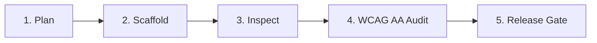

# UI/UX Pro Max Engineering Skill
*Adapted from the nextlevelbuilder/ui-ux-pro-max-skill architecture for Machine-First Design Agent Wiki.*

This skill establishes a closed-loop, deterministic execution framework for designing, implementing, and verifying user interfaces.

---

## 1. The 5-Step Execution Loop

Every interface build or modification MUST pass through the following 5 phases sequentially:

### Phase 1: Plan
- Define the user mental model, task goals, and key user flows.
- Specify active dial values (`DESIGN_VARIANCE`, `MOTION_INTENSITY`, `VISUAL_DENSITY`).
- Formulate component composition using existing verified registry items.
- Fill out [`templates/design-plan.md`](file:///d:/Concept%20projectcs/Agent%20Wiki/skills/ui-ux-pro-max/templates/design-plan.md).

### Phase 2: Scaffold
- Assemble layout structure using semantic HTML (`header`, `main`, `section`, `nav`, `aside`, `footer`).
- Import verified zero-slop components from `@/components/ui/` or query `@design-wiki/mcp`.
- Ensure all interactive elements have responsive containers and base states (normal, hover, active, focus, disabled).

### Phase 3: Inspect
- Inspect visual hierarchy: Is the eye naturally guided to the primary action?
- Verify spacing discipline: Are padding, margins, and gaps using standard Tailwind v4 tokens (e.g. `p-4`, `p-6`, `gap-4`)?
- Check responsive behavior across breakpoints (`sm:`, `md:`, `lg:`, `xl:`).

### Phase 4: WCAG AA Accessibility Audit
- Execute `python skills/ui-ux-pro-max/scripts/audit-a11y.py <file-path>` or run `pnpm test:a11y`.
- Contrast Verification:
  - Normal text (< 18pt): minimum contrast ratio **4.5:1** against background.
  - Large text (≥ 18pt or 14pt bold): minimum contrast ratio **3.0:1**.
  - UI components and graphical objects: minimum contrast ratio **3.0:1**.
- Verify keyboard accessibility:
  - All interactive items reachable via `Tab` / `Shift+Tab`.
  - Enter / Space activate buttons and toggles; arrow keys navigate menus/tabs/radios.
  - Visible focus indicator: `:focus-visible:ring-2 :focus-visible:ring-ring`.

### Phase 5: Release Gate
- Run automated anti-slop linter: `python verify-audit.py`.
- Ensure Health Score is **100/100** with 0 High, Medium, or Low violations.
- Verify machine-readable licensing and SPDX attribution headers.
- Generate delivery receipt.

---

## 2. Automated Quality Verification Commands

| Command | Purpose |
| :--- | :--- |
| `python skills/ui-ux-pro-max/scripts/audit-a11y.py <path>` | Evaluates contrast math, ARIA attributes, and keyboard bindings |
| `python verify-audit.py` | Runs the full 35-rule anti-slop verification suite |
| `pnpm review:taste <path>` | Evaluates compliance against active taste dials |
